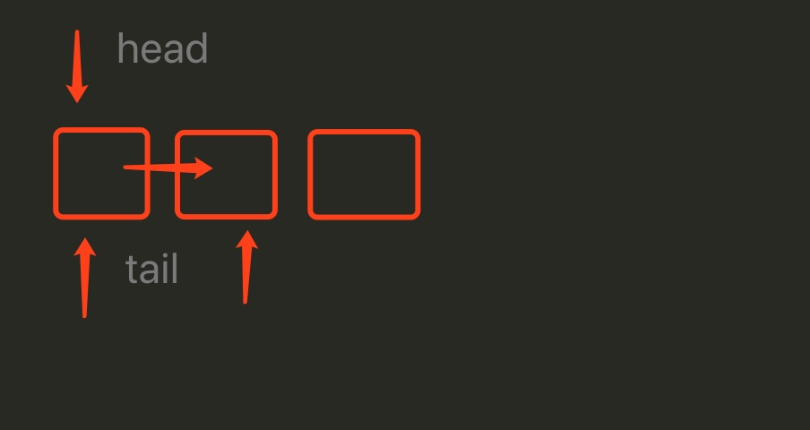

队列是一种先进先出的数据类型,需要一个尾指针辅助

入队示意图,head始终指向队列头,将tail->next指向新节点,然后tail指向新节点




输入:1-2-3-4
输出:1-2-3-4

```

//  Copyright © 2019 zhjzjnb. All rights reserved.

#include <stdio.h>
#include <string.h>
#include <stdlib.h>
#include <assert.h>

typedef int Data;

typedef struct Node{
    Data data;
    struct Node *next;
}Node;

typedef struct Queue{
    Node *head;
    Node *tail;
    int size;
}Queue;

//创建队列
Queue *create(){
    Queue *queue = malloc(sizeof(Queue));
    queue->head = NULL;
    queue->tail = NULL;
    queue->size = 0;
    return queue;
}

//进入队列
void enqueue(Queue *queue, Node *node){
    assert(queue!=NULL);
    assert(node!=NULL);
    Node *head = queue->head;
    queue->size++;
    node->next = NULL;
    if (head==NULL) {
        queue->head = node;
        queue->tail = node;
    }else{
        queue->tail->next = node;
        queue->tail = node;
    }
}

//数据出队
Node *dequeue(Queue *queue){
    assert(queue!=NULL);
    if (queue->size==0) {
        return NULL;
    }
    queue->size--;
    Node *head = queue->head;
    queue->head = head->next;
    return head;
}

// 清理
void cleanup(Queue **queue){
    assert(*queue!=NULL);
    
    Node *head = (*queue)->head;
    Node *tmp;
    while (head) {
        tmp = head;
        head = head->next;
        //        printf("free data:%d\n",tmp->data);
        free(tmp);
    }
    (*queue)->head = NULL;
    (*queue)->size = 0;
    *queue = NULL;
    free(*queue);
}
// 打印队列
void dump(Queue *queue){
    assert(queue!=NULL);
    if (queue->size<=0) {
        printf("0 len queue\n");
        return;
    }
    Node *head = queue->head;
    printf("dump begin\n");
    while (head) {
        printf("%d ",head->data);
        head = head->next;
    }
    printf("\ndump end\n");
}

int main(int argc, const char * argv[]) {
    Queue *queue = create();
    
    for (int i=0; i<10; i++) {
        Node *node = malloc(sizeof(Node));
        node->data = i;
        enqueue(queue,node);
    }
    
    dump(queue);
    
    Node *node = dequeue(queue);
    if(node){
        printf("pop success data:%d\n",node->data);
        free(node);
    }else{
        printf("pop failed\n");
    }

    dump(queue);
    cleanup(&queue);
    return 0;
}

```

