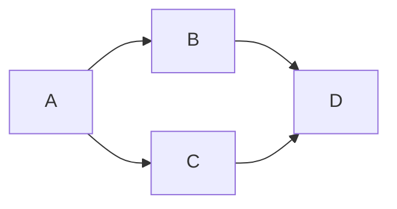

# 单项链表



# 代码

```

//  Copyright © 2019 zhjzjnb. All rights reserved.

#include <stdio.h>
#include <string.h>
#include <stdlib.h>
#include <assert.h>

typedef int Data;

typedef struct Node{
    Data data;
    struct Node *next;
}Node;

typedef struct LinkedList{
    Node *head;
    int len;
}LinkedList;

//创建一个表头
LinkedList *create(){
    LinkedList *linkedList = malloc(sizeof(LinkedList));
    linkedList->head = NULL;
    linkedList->len = 0;
    return linkedList;
}
//向表尾部插入一个节点
void insert(LinkedList *linkedList, Node *node){
    assert(linkedList!=NULL);
    assert(node!=NULL);
    node->next = NULL;
    Node *head = linkedList->head;
    linkedList->len++;
    if (head==NULL) {
        linkedList->head = node;
    }else{
        while (head->next) {
            head = head->next;
        }
        head->next = node;
    }
}
//根据数据查找一个节点
Node *find(LinkedList *linkedList, Data data){
    assert(linkedList!=NULL);
    assert(linkedList->len>0);
    Node *head = linkedList->head;
    while (head) {
        if (head->data==data) {
            return head;
        }
        head = head->next;
    }
    return NULL;
}
//根据数据删除一个节点
Node *delete(LinkedList *linkedList, Data data){
    assert(linkedList!=NULL);
    assert(linkedList->len>0);
    Node *head = linkedList->head;
    Node *tmp = head;
    while (head) {
        if (head->data==data) {
            if (tmp==head) {
                linkedList->len--;
                linkedList->head = tmp->next;
                return tmp;
            }
            tmp->next = head->next;
            return head;
        }
        tmp = head;
        head = head->next;
    }
    return NULL;
}
// 清理链表
void cleanup(LinkedList *linkedList){
    assert(linkedList!=NULL);
    
    Node *head = linkedList->head;
    Node *tmp;
    while (head) {
        tmp = head;
        head = head->next;
//        printf("free data:%d\n",tmp->data);
        free(tmp);
    }
    linkedList->head = NULL;
    linkedList->len = 0;
}
// 打印链表
void dump(LinkedList *linkedList){
    if (linkedList->len<=0) {
        printf("0 len linkedList\n");
        return;
    }
    Node *head = linkedList->head;
    printf("dump begin\n");
    while (head) {
        printf("%d ",head->data);
        head = head->next;
    }
    printf("\ndump end\n");
}

int main(int argc, const char * argv[]) {
    LinkedList *linkedList = create();
    
    for (int i=0; i<10; i++) {
        Node *node = malloc(sizeof(Node));
        node->data = i;
        insert(linkedList,node);
    }
    
    if(find(linkedList,3)){
        printf("find success data:3\n");
    }
    if(find(linkedList,21)){
        printf("find success data:21\n");
    }
    dump(linkedList);
    
    Node *node = delete(linkedList,31);
    if (node) {
        printf("delete success\n");
        free(node);
    }else{
        printf("delete fail\n");
    }
    
    dump(linkedList);
    cleanup(linkedList);
    dump(linkedList);
    
    free(linkedList);
    return 0;
}
```
